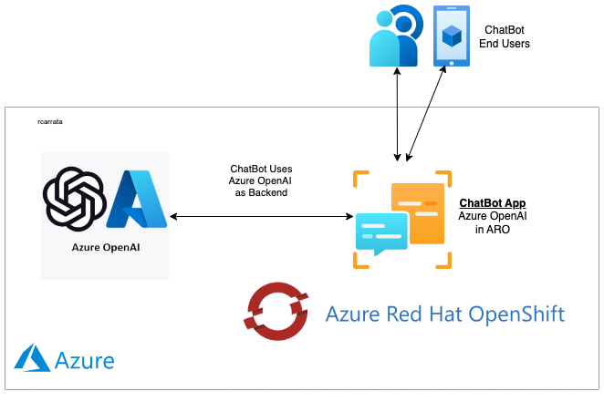
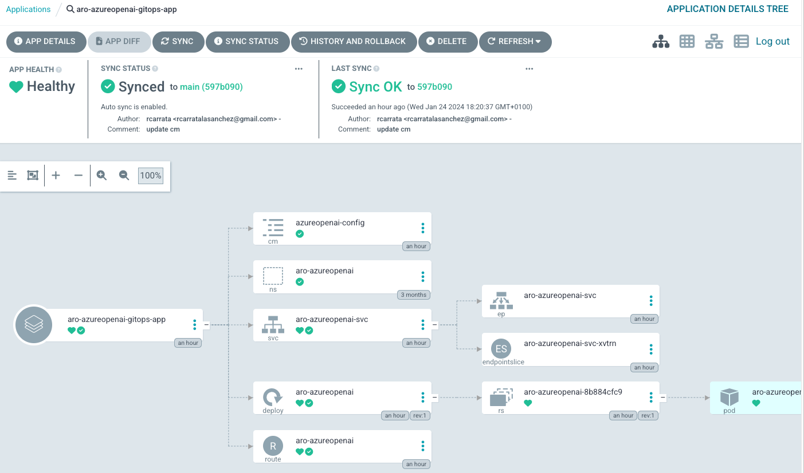

# ARO Azure OpenAI GitOps Repository

GitOps Repository for deploy the [ChatBot Demo of ARO and Azure OpenAI](https://github.com/rcarrat-AI/aro-azureopenai/tree/main).



This repository contains the necessary configurations and instructions for deploying a ChatBot Demo using Azure Red Hat OpenShift (ARO) and Azure OpenAI services using GitOps. 

Below is an overview of the steps and prerequisites needed for deployment.

## Prerequisites to deploy the ChatBot Demo

Before proceeding with the deployment of the ChatBot Demo, ensure that you have met the following prerequisites:

* [Azure OpenAI Prerequisites](./assets/azure-openai.md)
* Bootstrap Openshift GitOps / ArgoCD:

```bash
until kubectl apply -k bootstrap/base/; do sleep 2; done
```

### Deploy the ARO Azure OpenAI ChatBot App using GitOps

Once the prerequisites are met, you can proceed to deploy the ChatBot application. 

This is done using a GitOps approach, which means the application and its dependencies are declared in a Git repository and applied to the cluster in an automated manner.

To deploy the ChatBot app, execute the following command:

```bash
kubectl apply -k gitops/
```

This command applies the Kubernetes manifests defined in the gitops/ directory. It sets up the necessary resources and configurations for the ChatBot app in your ARO cluster using OpenShift GitOps / ArgoCD.



The above process illustrates the GitOps workflow for deploying applications on Kubernetes, leveraging Azure OpenAI and ARO. 
